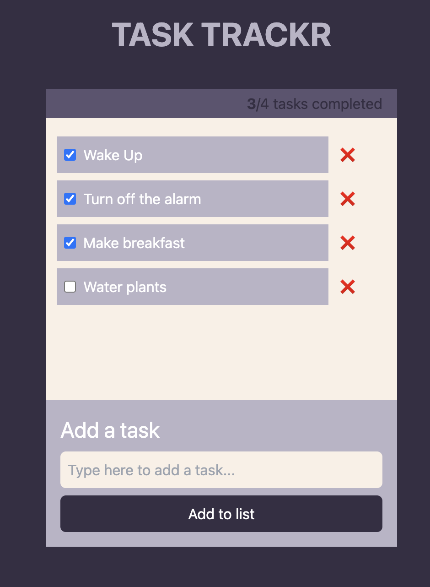
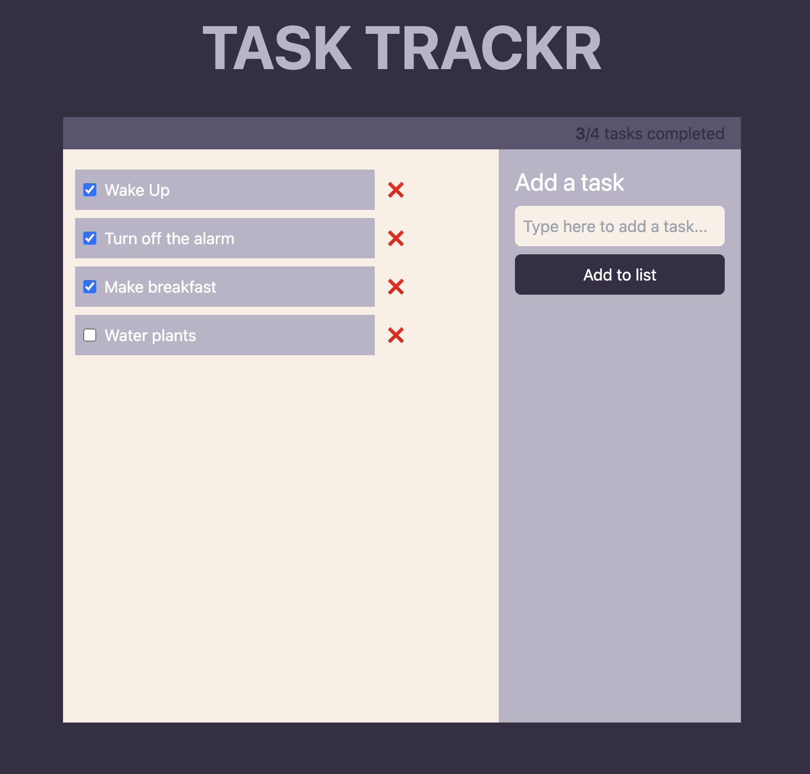
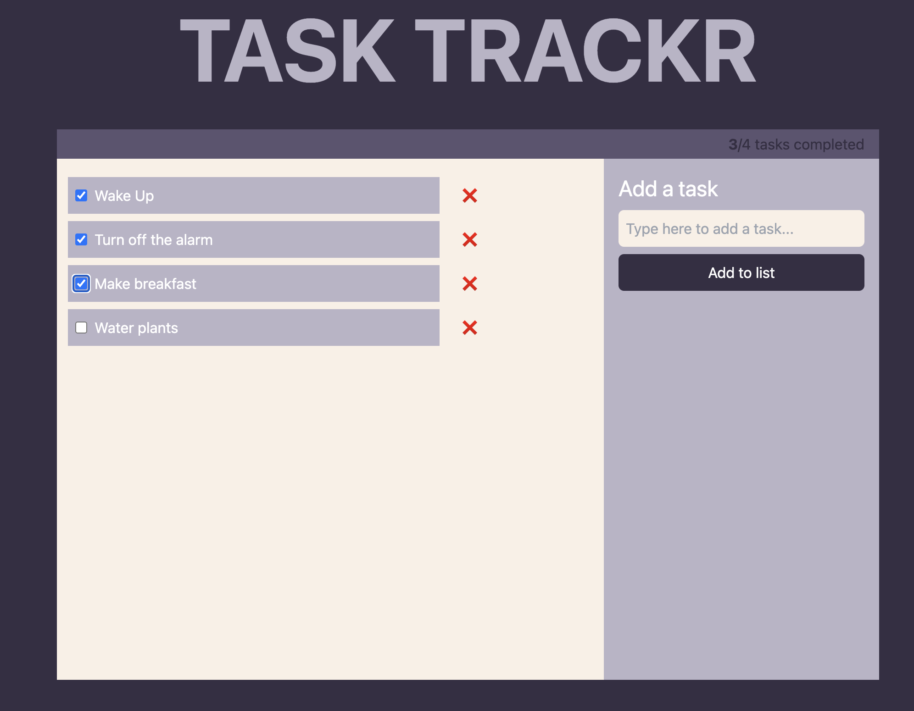

# My Vite TypeScript App with Tailwind CSS

This project is a Vite application built with TypeScript and styled using Tailwind CSS. This README will guide you through the steps to set up and run the project on your local machine.

## Table of Contents

- [Prerequisites](#prerequisites)
- [Installation](#installation)
- [Running the App](#running-the-app)
- [Building the App](#building-the-app)
- [App Screenshots](#app-screenshots)

## Prerequisites

Before you begin, ensure you have met the following requirements:

- **Node.js** (version 14 or later)
- **npm** (version 6 or later) or **yarn** (version 1.22 or later)

## Installation

1. **Clone the repository:**

   ```sh
   git clone https://github.com/naveensmacks/task-trackr
   cd your-repo-name
   ```

2. **Install dependencies:**

   If you're using npm:

   ```sh
   npm install
   ```

   If you're using yarn:

   ```sh
   yarn install
   ```

## Running the App

To start the development server, use the following command:

If you're using npm:

```sh
npm run dev
```

## App Screenshots

You can adjust the screen size to explore various user-friendly interface layouts.

- **Mobile View**

  

- **Tablet View**

  

- **Desktop View**

  
